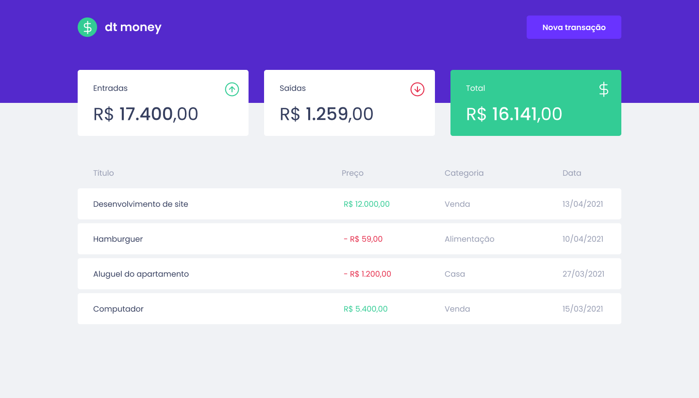

<h1 align="center">
  
</h1>

  <a href="#-projeto">Projeto</a>&nbsp;&nbsp;&nbsp;|&nbsp;&nbsp;&nbsp;
  <a href="#-layout">Layout</a>&nbsp;&nbsp;&nbsp;

 

## 💻 Projeto

Esse é a aplicação desenvolvida no primeiro módulo do Ignite, onde foi construído uma aplicação front-end utilizando conceitos e ferramentas do ecossistema React como Styled Components, MirageJS, Context API, Hooks, Axios e Typescript.

 

## 🎨 Layout
 

  

  

## :memo: Licença

Esse projeto está sob a licença MIT. Veja o arquivo [LICENSE](LICENSE.md) para mais detalhes.

---

Feito com ♥ por: <b> [Jonas Borges.](https://github.com/jonasborges93)</b>